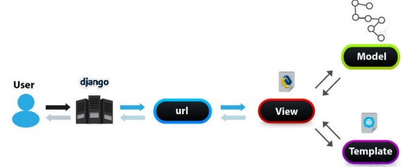

# Introducción a Django

Django es un Framework de Python que incluye un conjunto de componentes que resuelven
problemas comunes de desarrollo web. 

Utiliza el patrón MTV (similar al MVC):

* M – Model: Lógica de negocio y estructura de datos
* T – Template: Capa de presentación, las vistas en un MVC puro
* V – View. Controlador en el MVC

## 0.- Instalar Python (este paso no se detalla aquí)

https://www.python.org/downloads/

## 1.- Entorno Virtual

Crear entorno virtual:

```
C:\DAW\django> py -m venv entorno
```

Activar el entorno virtual:

```
C:\DAW\django> .\entorno\Scripts\activate
(entorno) C:\python>py -V
Python 3.11.1
(entorno) C:\DAW\django>pip -V
pip 22.3.1 from C:\DAW\django\entorno\Lib\site-packages\pip (python 3.11)
```

Para linux sería: source entorno/bin/activate

## 2.- Instalar Django

Puedes comprobar las versiones de Django disponibles con: ```pip index versions Django```

Para instalar utiliza:

```
(entorno) C:\DAW\django>pip install django
Collecting django
  Downloading Django-4.2.7-py3-none-any.whl (8.0 MB)
     ━━━━━━━━━━━━━━━━━━━━━━━━━━━━━━━━━━━━━━━━ 8.0/8.0 MB 1.4 MB/s eta 0:00:00
Collecting asgiref<4,>=3.6.0
  Downloading asgiref-3.7.2-py3-none-any.whl (24 kB)
Collecting sqlparse>=0.3.1
  Downloading sqlparse-0.4.4-py3-none-any.whl (41 kB)
     ━━━━━━━━━━━━━━━━━━━━━━━━━━━━━━━━━━━━━━━━ 41.2/41.2 kB 967.0 kB/s eta 0:00:00
Collecting tzdata
  Downloading tzdata-2023.3-py2.py3-none-any.whl (341 kB)
     ━━━━━━━━━━━━━━━━━━━━━━━━━━━━━━━━━━━━━━━━ 341.8/341.8 kB 1.6 MB/s eta 0:00:00
Installing collected packages: tzdata, sqlparse, asgiref, django
Successfully installed asgiref-3.7.2 django-4.2.7 sqlparse-0.4.4 tzdata-2023.3
```
y para ver la versión:

```
(entorno) C:\DAW\django>
(entorno) C:\DAW\django>py -m django --version
4.2.7

```

El comando ```pip freeze```  muestra todos los paquetes instalados.

```
(entorno) C:\DAW\django>pip freeze
asgiref==3.7.2
Django==4.2.7
sqlparse==0.4.4
tzdata==2023.3
```

## 3.- Crear un proyecto

```
(entorno) C:\DAW\django> django-admin startproject ppal
```
 

Se creará la carperta ppal con el siguiente contenido:

* manage.py: es la utilidad para interactuar con el proyecto.
* ppal/: este es el paquete Python del proyecto.
    * __init__.py: módulo Python.
    * asgi.py: configuración para ejecutar el proyecto como un servidor asíncrono
    * settings.py: fichero de configuración del proyecto
    * urls.py: fichero con los patrones de URL.
    * wsgi.py: configuración para ejecutar el proyecto como una interfaz de puerta de enlace del servidor web (WSGI).

Ejecutar el proyecto en el servidor de desarrollo para comprobar funcionamiento.

```
(entorno) C:\DAW\django> cd ppal
(entorno) C:\DAW\django\ppal> python manage.py runserver 
You have 18 unapplied migration(s). Your project may not work properly until you apply the migrations for app(s): admin, auth, contenttypes, sessions.
Run 'python manage.py migrate' to apply them.
December 03, 2023 - 18:05:16
Django version 4.2.7, using settings 'ppal.settings'
Starting development server at http://127.0.0.1:8000/
Quit the server with CTRL-BREAK.
```

NOTA: Como ves aparece el mensaje de que tenemos 18 migraciones no aplicadas. Más adelante se abordará este concepto.

Ahora se puede acceder en un navegador a la dirección: http://127.0.0.1:8000/

## 4.- Configurar URLs

Django usa el patrón MTV como se muestra en la figura:



Para crear los patrones URL que atenderá nuestra aplicación usaremos la variable urlpatterns del
fichero urls.py del proyecto. Como podemos observar ya viene con una ruta para la App Admin
de Django. Para añadir una ruta, utilizamos la función path incluyendo el patrón URL, una
función, una Class View o incluimos la ruta a otro fichero de urls de una app. Como ejemplo:

```
...
urlpatterns = [
 path('admin/', admin.site.urls),
 path('', holamundo)
]
...
```

A modo de ejemplo (solo por razones didácticas) crear en ese mismo fichero la función holamundo importando los paquetes necesarios (estamos incumpliendo las buenas prácticas para organización del proyecto, pero creo que nos ayudará a entender el funcionamiento).

```python
from django.http import HttpResponse
def holamundo(request):
 return HttpResponse("<h1>Hola Mundo!</h1>")
```
Volvamos a iniciar el proyecto y veamos el resultado en el navegador:

Para más información sobre los patrones URL consultar:
https://docs.djangoproject.com/en/4.2/topics/http/urls/

## 5.- Crear una aplicación

Un proyecto Django consta de varias aplicaciones.

Para crear una aplicación llamada blog:

```
(entorno) C:\DAW\django\ppal> python manage.py startapp blog
```

Esto creará una carpeta para la aplicación con el siguiente contenido:

* blog: módulo con el contenido de la aplicación.
    * migraciones: módulo con las migraciones para la base de datos.
    * __init__.py: módulo Python de la app.
    * admin.py: configuración de la aplicación Admin de Django
    * apps.py: configuración de la aplicación.
    * models.py: Modelos de la aplicación
    * tests.py: código para pruebas de la aplicación.
    * views.py: Views de la aplicación (Son el C de un MVC puro, no confundir con la V)

Las aplicaciones pertenecientes a un proyecto se indican en el fichero settings.py del proyecto, en la variable INSTALLED_APPS. El proyecto por defecto ya incluye varias aplicaciones y podemos registrar las nuestras con:

```python
INSTALLED_APPS = [
 # Django Apps
 'django.contrib.admin',
 'django.contrib.auth',
 'django.contrib.contenttypes',
 'django.contrib.sessions',
 'django.contrib.messages',
 'django.contrib.staticfiles',
 # Local Apps
 'blog.apps.BlogConfig'
]
```

## 6.- Migraciones

Por defecto Django utiliza Sqlite3 como base de datos, para configurar la base de datos se
utiliza la variable DATABASES del fichero settings.py del proyecto:

```python
DATABASES = {
    'default': {
        'ENGINE': 'django.db.backends.sqlite3',
        'NAME': BASE_DIR / 'db.sqlite3',
    }
}
```

Para configurar otros SGBD puede consultar:
https://docs.djangoproject.com/en/4.2/ref/databases/

Las migraciones son acciones que el ORM de Django va a realziar contra la Base de Datos para
que refleje el estado de los modelos de las aplicaciones instaladas (INSTALLED_APPS).Cuando
iniciamos el servidor nos aparecía el warning: "You have 18 unapplied migration(s)."

Se pueden comprobar las migraciones con:

```
(entorno) C:\DAW\django\ppal>python manage.py showmigrations
admin
 [ ] 0001_initial
 [ ] 0002_logentry_remove_auto_add
 [ ] 0003_logentry_add_action_flag_choices
auth
 [ ] 0001_initial
 [ ] 0002_alter_permission_name_max_length
 [ ] 0003_alter_user_email_max_length
 [ ] 0004_alter_user_username_opts
 [ ] 0005_alter_user_last_login_null
 [ ] 0006_require_contenttypes_0002
 [ ] 0007_alter_validators_add_error_messages
 [ ] 0008_alter_user_username_max_length
 [ ] 0009_alter_user_last_name_max_length
 [ ] 0010_alter_group_name_max_length
 [ ] 0011_update_proxy_permissions
 [ ] 0012_alter_user_first_name_max_length
contenttypes
 [ ] 0001_initial
 [ ] 0002_remove_content_type_name
sessions
 [ ] 0001_initial
```

También podemos ver en qué consisten las migraciones, por ejemplo:

```
(entorno) C:\DAW\django\ppal> python manage.py sqlmigrate sessions 0001
BEGIN;
--
-- Create model Session
--
CREATE TABLE "django_session" ("session_key" varchar(40) NOT NULL PRIMARY KEY, "session_data" text NOT NULL, "expire_date" datetime NOT NULL);
CREATE INDEX "django_session_expire_date_a5c62663" ON "django_session" ("expire_date");
COMMIT;
```

Finalmente, ejecutamos las migraciones con:

```
(entorno) C:\DAW\django\ppal>python manage.py migrate
Operations to perform:
  Apply all migrations: admin, auth, contenttypes, sessions
Running migrations:
  Applying contenttypes.0001_initial... OK
  Applying auth.0001_initial... OK
  Applying admin.0001_initial... OK
  Applying admin.0002_logentry_remove_auto_add... OK
  Applying admin.0003_logentry_add_action_flag_choices... OK
  Applying contenttypes.0002_remove_content_type_name... OK
  Applying auth.0002_alter_permission_name_max_length... OK
  Applying auth.0003_alter_user_email_max_length... OK
  Applying auth.0004_alter_user_username_opts... OK
  Applying auth.0005_alter_user_last_login_null... OK
  Applying auth.0006_require_contenttypes_0002... OK
  Applying auth.0007_alter_validators_add_error_messages... OK
  Applying auth.0008_alter_user_username_max_length... OK
  Applying auth.0009_alter_user_last_name_max_length... OK
  Applying auth.0010_alter_group_name_max_length... OK
  Applying auth.0011_update_proxy_permissions... OK
  Applying auth.0012_alter_user_first_name_max_length... OK
  Applying sessions.0001_initial... OK
```

Ahora si conectamos con la Base de Datos podemos ver las tablas creadas por
las migraciones. Para Sqlite3 utiliza por ejemplo DB Browser for SQLite.

## 7. - Modelos

Crear modelo Post. En el fichero models.py de la aplicación Blog crear la clase Post:

```python
from django.db import models

class Post(models.Model):
    title = models.CharField(max_length=250)
    body = models.TextField()
    publish = models.DateTimeField(null=True, blank=True)
    created = models.DateTimeField(auto_now_add=True)
    updated = models.DateTimeField(auto_now=True)

    def __str__(self):
        return self.title
```

Para crear las migraciones del modelo:

```
(entorno) C:\DAW\django\ppal>python manage.py makemigrations
Migrations for 'blog':
  blog\migrations\0001_initial.py
    - Create model Post
```

Será necesario volver a aplicar las nuevas migraciones:

```
(entorno) C:\DAW\django\ppal>python manage.py migrate
Operations to perform:
  Apply all migrations: admin, auth, blog, contenttypes, sessions
Running migrations:
  Applying blog.0001_initial... OK
```

Esto creará la tabla blog_post con los campos indicados (consultar con DB Browser for SQLite).

Si necesitamos hacer pruebas con el modelo (crear objetos, guardarlos y hacer concultas),
podemos utilizar el Shell de Django:

```
(entorno) C:\DAW\django\ppal>python  manage.py shell
Python 3.11.1 (tags/v3.11.1:a7a450f, Dec  6 2022, 19:58:39) [MSC v.1934 64 bit (AMD64)] on win32
Type "help", "copyright", "credits" or "license" for more information.
(InteractiveConsole)
>>> from blog.models import Post
>>> p1 = Post()
>>> p1.title = "Mi primer Post"
>>> p1.title
'Mi primer Post'
>>> p1.body='bla, bla, bla'
>>> p1.save()
>>> p2 = Post.objects.create(title='Second Post', body='ble, ble, ble')
>>> posts = Post.objects.all()
>>> posts
<QuerySet [<Post: First Post>, <Post: Second Post>]>
>>> post = Post.objects.get(id=1)
>>> post
<Post: First Post>
>>> Post.objects.filter(title__contains='Post')
<QuerySet [<Post: First Post>, <Post: Second Post>]>
>>> exit()
```

Puedes utilizar la documentación para más información sobre la creación y consultas:
https://docs.djangoproject.com/en/4.2/topics/db/queries/


## 8.- Templates

https://docs.djangoproject.com/en/4.2/ref/settings/#std-setting-TEMPLATES

Las plantillas, las vistas, se configuran en la variable TEMPLATES del fichero settings.py

```
TEMPLATES = [
    {
        'BACKEND': 'django.template.backends.django.DjangoTemplates',
        'DIRS': [],
        'APP_DIRS': True,
        'OPTIONS': {
            'context_processors': [
                'django.template.context_processors.debug',
                'django.template.context_processors.request',
                'django.contrib.auth.context_processors.auth',
                'django.contrib.messages.context_processors.messages',
            ],
        },
    },
]
```
Por ejemplo, si deseamos tener un directorio templates, a nivel del proyecto, con las plantillas, basta con incluir en DIRS su ubicación

```
 'DIRS': [
    BASE_DIR / 'templates'
 ],
```

Cargar ficheros estáticos (CSS, JS e imágenes)
https://docs.djangoproject.com/en/4.2/howto/static-files/

Tenemos que tener, en el fichero settings.py, la aplicación django.contrib.staticfiles incluída
en la variable INSTALLED_APPS, la variable STATIC_URL para definir la carpeta de estáticos de
cada aplicación y, si es necesario, en la variable STATICFILES_DIRS las rutas en las que deseamos
incluir los ficheros estáticos. Por ejemplo:

```
STATIC_URL = 'static/'
STATICFILES_DIRS = [
    BASE_DIR / "static",
]
```
En nuestros templates podemos incluir los ficheros estáticos con:

```html

<link rel="stylesheet" href="">


```

Creemos una plantilla base.html en el directorio template, incluitendo bloques (block) cuyo
contenido se definirá en los templates

```html
<!DOCTYPE html>
<html lang="en">
    <head>
        <meta charset="UTF-8">
        
        
        <link rel="stylesheet" href="https://cdn.jsdelivr.net/npm/bootstrap@5.2.3/dist/css/bootstrap.min.css"/>
        <link rel="stylesheet" href="https://use.fontawesome.com/releases/v5.1.0/css/all.css" />
        <link rel="stylesheet" href="" />
    </head>

    <body>
        <div>
            
        </div>
        <div class="container mt-5">
            
            
        </div>

        <script src="https://cdn.jsdelivr.net/npm/bootstrap@5.2.3/dist/js/bootstrap.bundle.min.js"></script>
    </body>
</html>
```

Creemos un template index.html en ese mismo directorio:

```html



 <title>Blog - Index</title>



 <h1>My Blog</h1>

```
Modifiquemos el contenido de la función holamundo del fichero urls.py
((Recuerda aún no estamos usando el patrón completo, esto no es una buena práctica el único
objetivo es entender el funcionamiento de los templates))

```python
from django.shortcuts import render
def holamundo(request):
    return render(request, 'index.html', {})
```

Ahora, si lanzamos el proyecto y accedemos en el navegador a la url http://127.0.0.0:8000,
Django buscará el path en el fichero urls.py, identificará que debe ejecutar la función
holamundo y esta función buscará el templata index.html, que a su vez extiende del template
base.html.

## 9. Views

((Recuerda, las Views del patrón MTV equivalen a los controladores del patrón MVC puro)).

Las Views pueden ser funciones o clases (class views), en este caso, empezaremos creando
funciones dentro del fichero views.py de la aplicación.

Los proyectos no incluyen un fichero para views, aunque podríamos crearlo si fuese necesario.

Por otra parte, cada aplicación si tiene un fichero views.py, en el que se definirán las views de
esa aplicación.

Creemos nuestra primera view llamada index en el fichero views.py de la aplicación Blog.

```python
from django.shortcuts import render

def index(request):
    return render(request, 'index.html')
```

Por otro lado, el proyecto incluye un fichero urls.py para definir las rutas, sin embargo, las
aplicaciones no incluyen por defecto un fichero urls.py para las rutas; aunque sería conveniente
incluir dicho fichero y poner la ruta en el del proyecto.

Aunque es este caso vamos a usar el fichero del proyecto, para ello cambiemos el contenido del
fichero urls.py para hacer uso de esa vista.

```python
from django.contrib import admin
from django.urls import path
from blog.views import index

urlpatterns = [
    path('admin/', admin.site.urls),
    path('', index, name=’index’)
]
```

Pasar información de la View al Template

Para pasar datos al template desde la View utilizaremos un diccionario que se incluirá como
tercer parámetro del método render

```python
from django.shortcuts import render
from blog.models import Post

def index(request):
    posts = Post.objects.all()
    return render(request, 'index.html', {'msg': 'Todo Ok!', 'posts': posts})
```

Modifiquemos ahora el template index.html para ver el contenido:

```html



<title>Blog - Index</title>



<h1>My Blog</h1>

<nav>
    <a href="">New</a>
</nav>


<div class="alert alert-info alert-dismissible fade show" role="alert">
    {{msg}}
    <button type="button" class="btn-close" data-bs-dismiss="alert" arialabel="Close"></button>
</div>


<div class="container d-flex flex-wrap">
    
    <div class="col-4 mt-2">
        <div class="card mx-2">
            <div class="card-body">
                <h5 class="card-title">{{p.title}}</h5>
                <p class="card-text">{{p.body}}</p>
                <p><small>{{p.created}}</small></p>
                <a href="" class="btn btn-info">Detail</a>
                <a href="#" class="btn btn-success">Edit</a>
                <a href="#" class="btn btn-danger">Delete</a>
                <a href="#" class="btn btn-warning">Like</a>
            </div>
        </div>
    </div>
    
</div>

```

## 10. Trabajando con Formularios

https://docs.djangoproject.com/en/4.2/topics/forms/
https://docs.djangoproject.com/en/4.2/topics/forms/modelforms/

Model Forms: Formularios para modelos

Creamos un fichero forms.py en la aplicación blog con el formulario para el modelo Post

```python
from django.forms import ModelForm
from blog.models import Post

class PostForm(ModelForm):
    class Meta:
        model = Post
        fields = ['title', 'body']
```

Creamos el template post/form.html

```html



<title>Blog - Index</title>



<h1>My Blog</h1>

<nav>
    <a href="">Home</a>
</nav>

<h2> Edit  Create new  Post</h2>

<div class="alert alert-{{type}} alert-dismissible fade show" role="alert">
    {{msg}}
    <button type="button" class="btn-close" data-bs-dismiss="alert" arialabel="Close"></button>
</div>


<div class="container">
    <div class="row justify-content-md-center">
        <div class="col-6 pt-3 pb-3" id="profile-box">
            <h4 class="mb-4"> Edit  Insert new  Post!</h4>
            <form method="POST" enctype="multipart/form-data">
                
                <input type="hidden" name="id" value="{{ id }}" />
                <div class="form-group mt-2">
                    <input  class="form-control is-invalid"       
                            type="text" name="title"  value="{{ form.title.value }}"  placeholder="Title" />
                    <div class="invalid-feedback">
                        {{ error }}
                    </div>
                </div>
                <div class="form-group mt-2">
                    <input  class="form-control is-invalid"
                            type="text" name="body"   value="{{ form.body.value }}"   placeholder="Body" />
                    <div class="invalid-feedback">
                        {{ error }}
                    </div>
                </div>
 
                <button type="submit" class="btn btn-primary btn-block mt5"> Publish!</button>
            </form>
        </div>
    </div>
</div>

```

### Añadir atributos al modelo

Añadimos el atributo likes

```python
from django.db import models

class Post(models.Model):
    title = models.CharField(max_length=250)
    body = models.TextField()
    likes = models.PositiveIntegerField(default=0)
    publish = models.DateTimeField(null=True, blank=True)
    created = models.DateTimeField(auto_now_add=True)
    updated = models.DateTimeField(auto_now=True)

    def __str__(self):
        return self.title
```

```
python manage.py makemigrations
Migrations for 'blog':
  blog\migrations\0002_post_likes.py
    - Add field likes to post
```

```
python manage.py makemigrations
Migrations for 'blog':
  blog\migrations\0002_post_likes.py
    - Add field likes to post
```

### NUEVO POST

Añadir URL:

```
urlpatterns = [
    ...

    path('new', new_post, name='new'),
    
]
```
Añadir en blog/views.py la acción para guardar los post

```python
def new_post(request):
    if request.method == 'POST':
        form = PostForm(request.POST)
        if form.is_valid():
            form.save()
        return redirect('index')
    else:
        form = PostForm()
    return render(request, 'posts/form.html', {'form': form})
```

### Editar

El formulario ya está preparado para editar. 

URL
```python
urlpatterns = [

    ...
    path('edit/<int:id>', edit, name='edit'),

]
```

Acción 
```python
def edit(request, id):
    try:
        post = Post.objects.get(pk=id)
    except Post.DoesNotExist:
        msg = "Post #" + str(id) + " no encontrado"
        return render(request, 'index.html', {'msg': msg})  

    if request.method == 'POST':
        form = PostForm(request.POST, instance=post)
        if form.is_valid():
            form.save()
        return redirect('index')
    else:
        form = PostForm(instance=post)
 
    return render(request, 'posts/form.html', {'form': form, 'id':id})
```

### Detalles

URL
```python
urlpatterns = [
    ...
    path('details/<int:id>', details, name='details'),

]
```

Acción:
```python
def details(request, id):
    try:
        post = Post.objects.get(pk=id)
    except Post.DoesNotExist:
        msg = "Post #" + str(id) + " no encontrado"
        return render(request, 'index.html', {'msg': msg})
    msg = "Detalles Post: " + str(id)
    return render(request, 'details.html', {'msg': msg, 'post': post})
```

Template: details.html

```html



<title>Blog - Index</title>




<h1>My Blog</h1>

<nav>
    <a href="">Home</a>
</nav>


<div class="alert alert-info alert-dismissible fade show" role="alert">
 {{msg}}
 <button type="button" class="btn-close" data-bs-dismiss="alert" arialabel="Close"></button>
</div>


<div class="container d-flex flex-wrap">

    <div class="col-4 mt-2">
        <div class="card mx-2">
            <div class="card-body">
                <h5 class="card-title">{{post.title}}</h5>
                <p class="card-text">{{post.body}}</p>
                <p><small>{{post.created}}</small> (likes: {{post.likes}})</p>
                <a href="" class="btn btn-warning">Like</a>
            </div>
        </div>
    </div>
</div>


```


### DELETE

Añadimos la URL:

```python
urlpatterns = [
    ...
    path('delete/<int:id>', delete, name='delete'),

]
```

Añadimos la acción delete en el controlador (views.py)

```python
def delete(request, id):
    try:
        post = Post.objects.get(pk=id)
        post.delete()
    except Post.DoesNotExist:
        msg = "Post #" + str(id) + " no encontrado"
        return render(request, 'index.html', {'msg': msg})
    msg = "Borrado Post: " + str(id)
    posts = Post.objects.all()
    return render(request, 'index.html', {'msg': msg, 'posts': posts})
```

### Dar likes

URL:
```
urlpatterns = [
    ...

    path('like/<int:id>', like, name='like'),
]
```

Acción:

```python
def like(request, id):
    try:
        post = Post.objects.get(pk=id)
        post.likes = post.likes+1
        post.save()
    except Post.DoesNotExist:
        msg = "Post #" + str(id) + " no encontrado"
        return render(request, 'index.html', {'msg': msg})    
    msg = "Like Post: " + str(id)
    return render(request, 'details.html', {'msg': msg, 'post': post})

```
